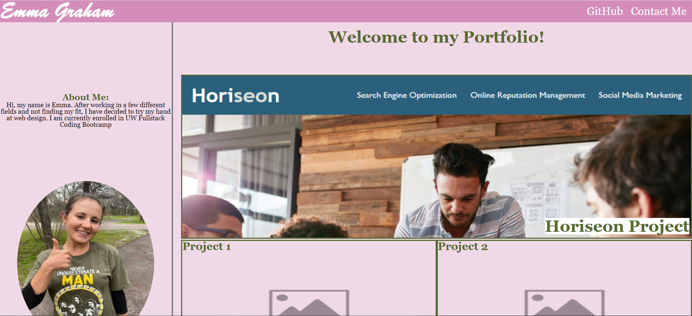
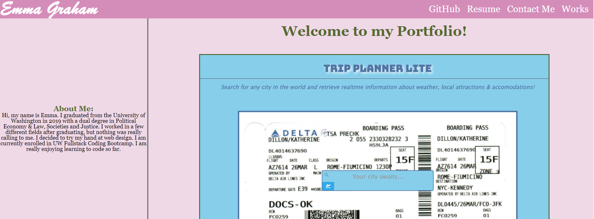

# Homework Assignment 8 - Professional Materials

## Description:
This assignment required us to revisit the Professional Portfolio we made in Homework Assignment #2 (https://github.com/egraham96/Professional-Portfolio). In Homework Assignment #2, we were asked to built a Portfolio that would showcase our completed applications. At the time, our website had to be responsive to different screen sizes, had to include working links & pseudoclasses such as hover and working images. Since completing Homework Assignment #2, I have learned Javascript, jQuery, jQuery UI, Bootstrap, Node.JS, and Web APIS--these new languages are reflected in the 4 projects I added to the Portfolio. I also added screenshots & links to the 4 new projects. I added my Resume and links to my GitHub & LinkedIn profile. I updated the styling of the page. I made the ReadMe for this Portfolio more comprehensive. 

## Built With:
* HTML
* CSS

## Deployed Links:
* [See Live Site](https://egraham96.github.io/Portfolio-Update-1/)
* [Link to GitHub Repo](https://github.com/egraham96/Portfolio-Update-1)

## Preview of Working Site:

## How to Contribute:
If you'd like to contribute to this project please send an email to eeg4@uw.edu or message me on github: egraham96

## License:

